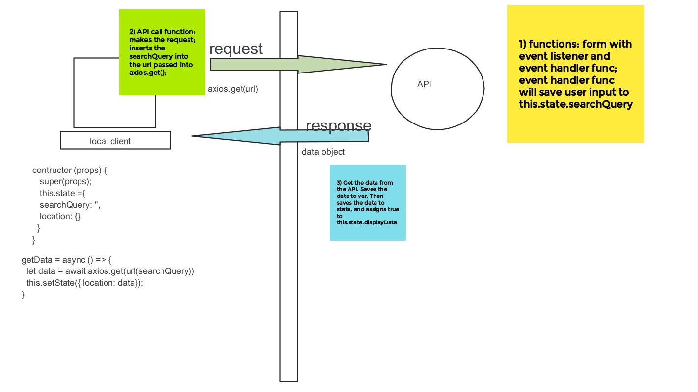
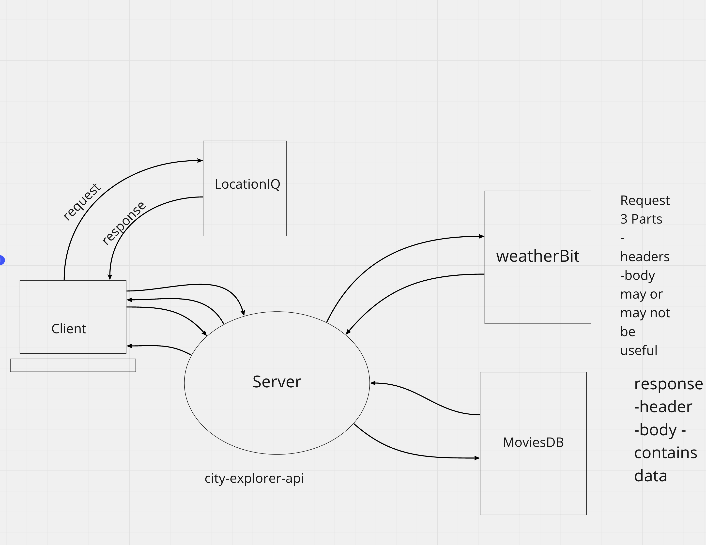

# city-explorer-api

Cit Explorer API
**Author**: Your Name Goes Here
**Version**: 1.0.0 (increment the patch/fix version number if you make more commits past your first submission)

## Overview

City Explorer API

## Getting Started

- Clone Down GitHub Repo [GitHub Repo](https://github.com/joshuamccluskey/city-explorer-api)
- `cd city-explorer-api`
- `npm init`
  - endpoint: `server.js`
- `npm install express`
- `npm install dotenv`
- `npm install cors`
- `cp (Configs docs path) .(currentdirectory)`
- `npm -g i nodemon`
- `nodemon`

## Architecture

- Express
- Nodemon
- Node
- JavaScript
- CORS
- dotenv

## Change Log

- 01.18.2022 7:30 PM PST Completed server repo
- 01.18.2022 10:00 PM PST Completed back-end server taks Card 2
- 01.20.2021 05:30 PM PST - Updates for lab 07
- 01.21.2021 02:30 PM PST - Lab08 Complete Deployment on Heroku
- 01.21.2021 02:30 PM PST - Lab09 Code Base Refactored
- 01.25.2021 04:30 AM PST - Troubleshooted Server back up
- 01.25.2021 02:00 PM PST - Lab 10,9,8,7 updates and Complete

## Credit and Collaborations

- Credit: Kevin Lamarca on collaboration on WRRC Design
- Credit: Regan Hayes on Collaboration on WRRC Server Diagram
- Credit: Chuck Altopiedi on Collaboration on WRRC API Diagram
- Credit: Brian Thornburg on Collaboration on WRRC Require Diagram
- Credit: Robb Alexander and Brian Thornburg on WRRC Cache Diagram

### Name of feature: Card 1 Setup Server Repo

Estimate of time needed to complete: 1 hour

Start time: 7:00 PM PST

Finish time: 7:30 PM PST

Actual time needed to complete: 30 minutes

### Name of feature: Card 2 Weather Placeholder

Estimate of time needed to complete: 1 hour

Start time: 8:00 PM PST

Finish time: 10:00 PM PST

Actual time needed to complete: 2 Hours

### Lab 07 Updates

Estimate of time needed to complete: 1 hour

Start time: 4:15 PM PST

Finish time: 5:30 PM PST

Actual time needed to complete: 1.25 hours

### Lab08 API Card 1

Estimate of time needed to complete: 1 hour

Start time: 9:30 PM PST

Finish time: 12:30 PM PST

Actual time needed to complete: 3 hours

### Lab08 Complete

Estimate of time needed to complete: 3 hour

Start time: 9:30 PM PST

Finish time: 12:30 PM PST

Actual time needed to complete: 3 hours

### Lab09

Estimate of time needed to complete: 1 hour

Start time: 8:30 PM PST

Finish time: 10:00 PM PST

Actual time needed to complete: 2.5 hours

### Lab10

Estimate of time needed to complete: 2 hour

Start time: 2:00 AM PST

Finish time: 3:00 AM PST

Actual time needed to complete: 1 hours

### Lab10 Part Deux

Estimate of time needed to complete: 2 hour

Start time: 2:30 AM PST

Finish time: 4:30 AM PST

Actual time needed to complete: 2 hours
